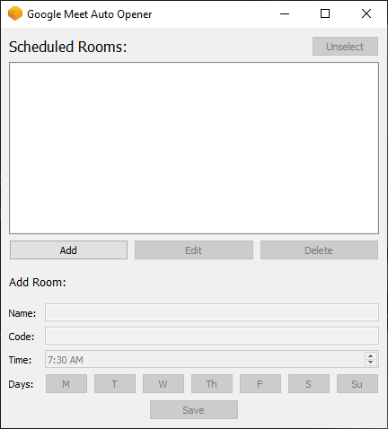
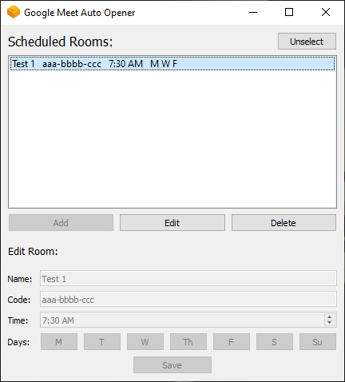

# Google Meet Auto Opener
 ### A GUI application that allows user to schedule when to open a Google Meet room
 
 ### What it does:
 1. Opens a Google Meet room in your default browser based on given meet code at a scheduled time and date.

 ### How to use:
 
 1. Click add button to create schedule for a room.   
 Fill out the needed information and click save.
 
  
  
 2. Click on a room from the list to edit / delete scheduled room.  
 Click unselect to add room again.

 
